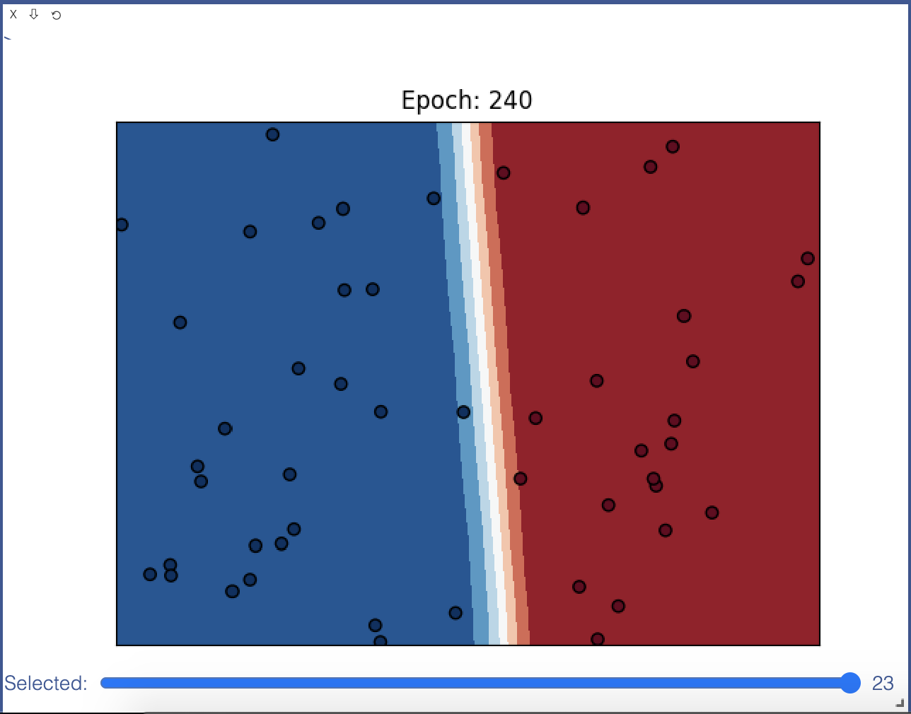
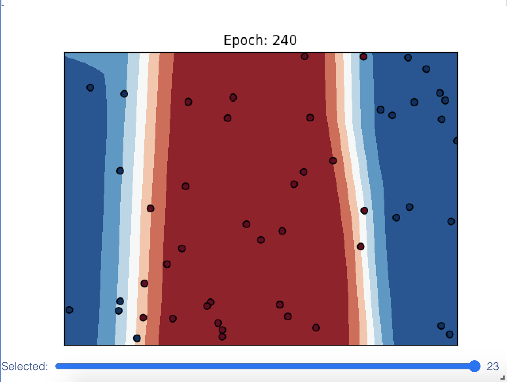
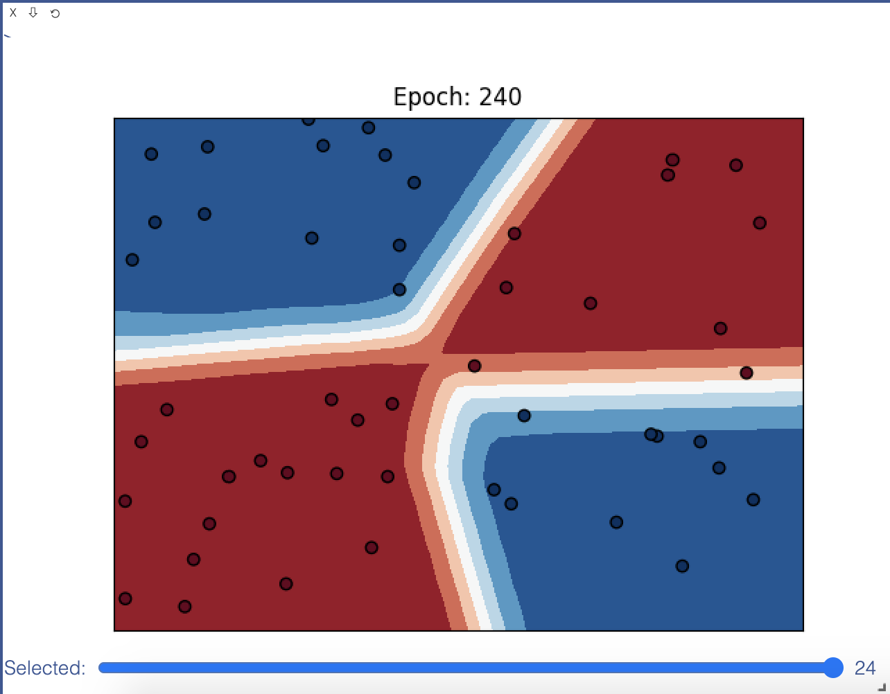

[](https://classroom.github.com/online_ide?assignment_repo_id=3476044&assignment_repo_type=AssignmentRepo)
# MiniTorch Module 3


* Docs: https://minitorch.github.io/

* Overview: https://minitorch.github.io/module3.html

This module requires `scalar.py`, `tensor_functions.py`, `tensor_data.py`, `tensor_ops.py`, `operators.py`, `module.py`, and `autodiff.py` from Module 2.

You will need to modify `tensor_functions.py` slightly in this assignment.

* Tests:

```
python run_tests.py
```

* Note:

Several of the tests for this assignment will only run if you are on a GPU machine and will not
run on github's test infrastructure. Please follow the instructions to setup up a colab machine
to run these tests.

***Task 3.1***
```
================================================================================
 Parallel Accelerator Optimizing:  Function tensor_map.<locals>._map,
/content/minitorch-3-tonyhsu1013/minitorch/fast_ops.py (40)  
================================================================================


Parallel loop listing for  Function tensor_map.<locals>._map, /content/minitorch-3-tonyhsu1013/minitorch/fast_ops.py (40)
--------------------------------------------------------------------------------|loop #ID
    def _map(out, out_shape, out_strides, in_storage, in_shape, in_strides):    |
        # TODO: Implement for Task 3.1.                                         |
        for i in prange(len(out)):----------------------------------------------| #0
            # Create the indices                                                |
            out_index = np.empty(MAX_DIMS, np.int32)                            |
            in_index = np.empty(MAX_DIMS, np.int32)                             |
                                                                                |
            # Figure out current index                                          |
            count(int(i), out_shape, out_index)                                 |
            broadcast_index(out_index, out_shape, in_shape, in_index)           |
                                                                                |
            # Map input into output                                             |
            o = index_to_position(out_index, out_strides)                       |
            j = index_to_position(in_index, in_strides)                         |
            out[o] = fn(in_storage[j])                                          |
--------------------------------- Fusing loops ---------------------------------
Attempting fusion of parallel loops (combines loops with similar properties)...
Following the attempted fusion of parallel for-loops there are 1 parallel for-
loop(s) (originating from loops labelled: #0).
--------------------------------------------------------------------------------
----------------------------- Before Optimisation ------------------------------
--------------------------------------------------------------------------------
------------------------------ After Optimisation ------------------------------
Parallel structure is already optimal.
--------------------------------------------------------------------------------
--------------------------------------------------------------------------------

---------------------------Loop invariant code motion---------------------------
Allocation hoisting:
The memory allocation derived from the instruction at
/content/minitorch-3-tonyhsu1013/minitorch/fast_ops.py (44) is hoisted out of
the parallel loop labelled #0 (it will be performed before the loop is executed
and reused inside the loop):
   Allocation:: out_index = np.empty(MAX_DIMS, np.int32)
    - numpy.empty() is used for the allocation.
The memory allocation derived from the instruction at
/content/minitorch-3-tonyhsu1013/minitorch/fast_ops.py (45) is hoisted out of
the parallel loop labelled #0 (it will be performed before the loop is executed
and reused inside the loop):
   Allocation:: in_index = np.empty(MAX_DIMS, np.int32)
    - numpy.empty() is used for the allocation.
None
ZIP

================================================================================
 Parallel Accelerator Optimizing:  Function tensor_zip.<locals>._zip,
/content/minitorch-3-tonyhsu1013/minitorch/fast_ops.py (112)  
================================================================================


Parallel loop listing for  Function tensor_zip.<locals>._zip, /content/minitorch-3-tonyhsu1013/minitorch/fast_ops.py (112)
----------------------------------------------------------------------------------|loop #ID
    def _zip(                                                                     |
        out,                                                                      |
        out_shape,                                                                |
        out_strides,                                                              |
        a_storage,                                                                |
        a_shape,                                                                  |
        a_strides,                                                                |
        b_storage,                                                                |
        b_shape,                                                                  |
        b_strides,                                                                |
    ):                                                                            |
        # TODO: Implement for Task 3.1.                                           |
        for i in prange(len(out)):------------------------------------------------| #1
            # Create the indices                                                  |
            out_index = np.empty(MAX_DIMS, np.int32)                              |
            a_index = np.empty(MAX_DIMS, np.int32)                                |
            b_index = np.empty(MAX_DIMS, np.int32)                                |
                                                                                  |
            # Figure out the output position and corresponding input positions    |
            count(int(i), out_shape, out_index)                                   |
            o = index_to_position(out_index, out_strides)                         |
            broadcast_index(out_index, out_shape, a_shape, a_index)               |
            j = index_to_position(a_index, a_strides)                             |
            broadcast_index(out_index, out_shape, b_shape, b_index)               |
            k = index_to_position(b_index, b_strides)                             |
                                                                                  |
            # Peform zip function with inputs                                     |
            out[o] = fn(a_storage[j], b_storage[k])                               |
--------------------------------- Fusing loops ---------------------------------
Attempting fusion of parallel loops (combines loops with similar properties)...
Following the attempted fusion of parallel for-loops there are 1 parallel for-
loop(s) (originating from loops labelled: #1).
--------------------------------------------------------------------------------
----------------------------- Before Optimisation ------------------------------
--------------------------------------------------------------------------------
------------------------------ After Optimisation ------------------------------
Parallel structure is already optimal.
--------------------------------------------------------------------------------
--------------------------------------------------------------------------------

---------------------------Loop invariant code motion---------------------------
Allocation hoisting:
The memory allocation derived from the instruction at
/content/minitorch-3-tonyhsu1013/minitorch/fast_ops.py (126) is hoisted out of
the parallel loop labelled #1 (it will be performed before the loop is executed
and reused inside the loop):
   Allocation:: out_index = np.empty(MAX_DIMS, np.int32)
    - numpy.empty() is used for the allocation.
The memory allocation derived from the instruction at
/content/minitorch-3-tonyhsu1013/minitorch/fast_ops.py (127) is hoisted out of
the parallel loop labelled #1 (it will be performed before the loop is executed
and reused inside the loop):
   Allocation:: a_index = np.empty(MAX_DIMS, np.int32)
    - numpy.empty() is used for the allocation.
The memory allocation derived from the instruction at
/content/minitorch-3-tonyhsu1013/minitorch/fast_ops.py (128) is hoisted out of
the parallel loop labelled #1 (it will be performed before the loop is executed
and reused inside the loop):
   Allocation:: b_index = np.empty(MAX_DIMS, np.int32)
    - numpy.empty() is used for the allocation.
None
REDUCE

================================================================================
 Parallel Accelerator Optimizing:  Function tensor_reduce.<locals>._reduce,
/content/minitorch-3-tonyhsu1013/minitorch/fast_ops.py (190)  
================================================================================


Parallel loop listing for  Function tensor_reduce.<locals>._reduce, /content/minitorch-3-tonyhsu1013/minitorch/fast_ops.py (190)
------------------------------------------------------------------------------|loop #ID
    def _reduce(                                                              |
        out,                                                                  |
        out_shape,                                                            |
        out_strides,                                                          |
        a_storage,                                                            |
        a_shape,                                                              |
        a_strides,                                                            |
        reduce_shape,                                                         |
        reduce_size,                                                          |
    ):                                                                        |
        # TODO: Implement for Task 3.1.                                       |
        for i in prange(len(out)):--------------------------------------------| #2
            # Create indices                                                  |
            out_index = np.empty(MAX_DIMS, np.int32)                          |
            a_index = np.empty(MAX_DIMS, np.int32)                            |
            # Get the current index                                           |
            count(int(i), out_shape, out_index)                               |
            o = index_to_position(out_index, out_strides)                     |
                                                                              |
            # Iterating through the dimension we're reducing                  |
            for s in range(reduce_size):                                      |
                # Figure out the position we're reducing in this iteration    |
                count(s, reduce_shape, a_index)                               |
                # Reducing by going over the dimension we're not reducing     |
                for k in range(len(reduce_shape)):                            |
                    if reduce_shape[k] != 1:                                  |
                        out_index[k] = a_index[k]                             |
                # Map to corresponding position in the storage                |
                j = index_to_position(out_index, a_strides)                   |
                # Reduce at the position by aggregating the function          |
                out[o] = fn(out[o], a_storage[j])                             |
--------------------------------- Fusing loops ---------------------------------
Attempting fusion of parallel loops (combines loops with similar properties)...
Following the attempted fusion of parallel for-loops there are 1 parallel for-
loop(s) (originating from loops labelled: #2).
--------------------------------------------------------------------------------
----------------------------- Before Optimisation ------------------------------
--------------------------------------------------------------------------------
------------------------------ After Optimisation ------------------------------
Parallel structure is already optimal.
--------------------------------------------------------------------------------
--------------------------------------------------------------------------------

---------------------------Loop invariant code motion---------------------------
```

***Task 3.5***

**Simple**



```
Epoch  0  loss  0.8115374843272172 correct 26 time 11.625386714935303
Epoch  10  loss  0.6615761135541888 correct 41 time 0.02391839027404785
Epoch  20  loss  0.4068036971581372 correct 32 time 0.024000167846679688
Epoch  30  loss  0.38979913860630033 correct 47 time 0.021924257278442383
Epoch  40  loss  0.3212170963629087 correct 34 time 0.02339768409729004
Epoch  50  loss  0.3101835572249518 correct 39 time 0.023936748504638672
Epoch  60  loss  0.27075266563884626 correct 41 time 0.021871328353881836
Epoch  70  loss  0.21000038599883403 correct 49 time 0.02933979034423828
Epoch  80  loss  0.1717407835622658 correct 38 time 0.022722721099853516
Epoch  90  loss  0.1945744672737717 correct 50 time 0.030732393264770508
Epoch  100  loss  0.1438322848895009 correct 50 time 0.023026227951049805
Epoch  110  loss  0.11292589294016127 correct 50 time 0.022498607635498047
Epoch  120  loss  0.09245892947420156 correct 50 time 0.023288249969482422
Epoch  130  loss  0.07804113624207626 correct 50 time 0.021452665328979492
Epoch  140  loss  0.06732902887709204 correct 50 time 0.020377635955810547
Epoch  150  loss  0.05912940330972499 correct 50 time 0.02082371711730957
Epoch  160  loss  0.052665544971095074 correct 50 time 0.023122072219848633
Epoch  170  loss  0.047445559736061925 correct 50 time 0.022700071334838867
Epoch  180  loss  0.04314295257132114 correct 50 time 0.025417089462280273
Epoch  190  loss  0.0395362615879149 correct 50 time 0.020892620086669922
Epoch  200  loss  0.03648121047686759 correct 50 time 0.024729490280151367
Epoch  210  loss  0.0338513918964994 correct 50 time 0.02340102195739746
Epoch  220  loss  0.03157223185221913 correct 50 time 0.032886505126953125
Epoch  230  loss  0.02957474381129582 correct 50 time 0.02794504165649414
Epoch  240  loss  0.02780764153777651 correct 50 time 0.022687673568725586
```

**Split**




```
Epoch  0  loss  8.253892259327907 correct 21 time 11.43214225769043
Epoch  10  loss  0.25681731473594305 correct 46 time 0.028209686279296875
Epoch  20  loss  0.09110369730997668 correct 36 time 0.028677701950073242
Epoch  30  loss  0.093266250891492 correct 41 time 0.0309140682220459
Epoch  40  loss  0.10528092297455953 correct 46 time 0.02991318702697754
Epoch  50  loss  0.06565384363987366 correct 44 time 0.029664993286132812
Epoch  60  loss  0.07283344563734302 correct 47 time 0.028163671493530273
Epoch  70  loss  0.04251092798311721 correct 48 time 0.02819228172302246
Epoch  80  loss  0.07452171237224656 correct 39 time 0.02866673469543457
Epoch  90  loss  0.031778850336062835 correct 49 time 0.028846263885498047
Epoch  100  loss  0.018900816637682276 correct 49 time 0.034034013748168945
Epoch  110  loss  0.013096485484722196 correct 49 time 0.02550053596496582
Epoch  120  loss  0.0097168104613595 correct 49 time 0.03404855728149414
Epoch  130  loss  0.007455711952113534 correct 49 time 0.029031753540039062
Epoch  140  loss  0.005810440646525939 correct 49 time 0.03072810173034668
Epoch  150  loss  0.00455727737658314 correct 49 time 0.029576539993286133
Epoch  160  loss  0.0036620888899124254 correct 49 time 0.029871225357055664
Epoch  170  loss  0.002991388745258739 correct 49 time 0.02967047691345215
Epoch  180  loss  0.002458762243811803 correct 49 time 0.02773284912109375
Epoch  190  loss  0.0020364795579092903 correct 49 time 0.026233196258544922
Epoch  200  loss  0.0017024899364511327 correct 49 time 0.03116297721862793
Epoch  210  loss  0.0014316890692588607 correct 49 time 0.02790689468383789
Epoch  220  loss  0.001205138302835357 correct 49 time 0.028550148010253906
Epoch  230  loss  0.001023529707805244 correct 49 time 0.02840447425842285
Epoch  240  loss  0.0008733129988689726 correct 49 time 0.02837848663330078
```

**Xor**




```
Epoch  0  loss  1.4911400142885405 correct 24 time 11.389892339706421
Epoch  10  loss  0.3051049014858561 correct 43 time 0.029781341552734375
Epoch  20  loss  0.1680147585812506 correct 46 time 0.029723644256591797
Epoch  30  loss  0.1930485585183608 correct 45 time 0.028371334075927734
Epoch  40  loss  0.05740956702874674 correct 46 time 0.028237342834472656
Epoch  50  loss  0.1278054344080828 correct 44 time 0.028899669647216797
Epoch  60  loss  0.055605078161716594 correct 47 time 0.028101444244384766
Epoch  70  loss  0.244759122936658 correct 45 time 0.02814030647277832
Epoch  80  loss  0.026266153563819637 correct 47 time 0.03120899200439453
Epoch  90  loss  0.00943619152798269 correct 48 time 0.027229785919189453
Epoch  100  loss  0.004974112571728845 correct 48 time 0.02790379524230957
Epoch  110  loss  0.00215806833546114 correct 47 time 0.02819347381591797
Epoch  120  loss  0.00015048662947909404 correct 44 time 0.027890920639038086
Epoch  130  loss  0.004827391936725887 correct 49 time 0.03845691680908203
Epoch  140  loss  0.003936617921213341 correct 50 time 0.029860973358154297
Epoch  150  loss  0.003956523325207213 correct 50 time 0.03438830375671387
Epoch  160  loss  0.0036263468567022585 correct 50 time 0.02856612205505371
Epoch  170  loss  0.0026462589907807863 correct 50 time 0.02835845947265625
Epoch  180  loss  0.002125962572704991 correct 50 time 0.028585195541381836
Epoch  190  loss  0.0017000231976223895 correct 50 time 0.028174400329589844
Epoch  200  loss  0.0013058185299101475 correct 50 time 0.028139352798461914
Epoch  210  loss  0.0010900340255372337 correct 50 time 0.033341169357299805
Epoch  220  loss  0.0009229842464784575 correct 50 time 0.03003978729248047
Epoch  230  loss  0.0007533190415724576 correct 50 time 0.02795100212097168
Epoch  240  loss  0.0006387156567613116 correct 50 time 0.03471946716308594
```

- Recording the epoch time for `python run_fast_tensor.py --BACKEND gpu --HIDDEN 100 --DATASET split --RATE 0.05`:
```
Epoch  0  loss  -9.871195303011403e-07 correct 31 time 2.3442234992980957
Epoch  10  loss  -9.999285103304579e-07 correct 31 time 0.388397216796875
Epoch  20  loss  6.672067926094724 correct 18 time 0.38930177688598633
Epoch  30  loss  2.0881262639432743e-05 correct 31 time 0.449446439743042
Epoch  40  loss  4.1479326677150256e-05 correct 31 time 0.37870097160339355
Epoch  50  loss  0.00037779977116788926 correct 34 time 0.38972020149230957
Epoch  60  loss  0.003947679532732116 correct 42 time 0.3974928855895996
Epoch  70  loss  0.030616969438242773 correct 46 time 0.3894662857055664
Epoch  80  loss  0.03552306435619996 correct 46 time 0.3884718418121338
Epoch  90  loss  0.03083828396708433 correct 46 time 0.4010143280029297
Epoch  100  loss  0.04220570824883119 correct 49 time 0.39063072204589844
Epoch  110  loss  0.056591461965939574 correct 49 time 0.382082462310791
Epoch  120  loss  0.061089636983593446 correct 50 time 0.377410888671875
Epoch  130  loss  0.0570645799183011 correct 50 time 0.37247610092163086
Epoch  140  loss  0.05081222619848155 correct 50 time 0.37886643409729004
Epoch  150  loss  0.04641176123708595 correct 50 time 0.3839132785797119
Epoch  160  loss  0.04214410544019111 correct 50 time 0.3876643180847168
Epoch  170  loss  0.03772532427564381 correct 50 time 0.38230037689208984
Epoch  180  loss  0.034205663740766265 correct 50 time 0.39067888259887695
Epoch  190  loss  0.03139183645623225 correct 50 time 0.3804357051849365
Epoch  200  loss  0.029327045303163674 correct 50 time 0.3911757469177246
Epoch  210  loss  0.02723704171711271 correct 50 time 0.38416266441345215
Epoch  220  loss  0.02536325896641179 correct 50 time 0.3919677734375
Epoch  230  loss  0.02372225746140871 correct 50 time 0.39301586151123047
Epoch  240  loss  0.022402632979645447 correct 50 time 0.392409086227417
```

- Recording the epoch time for `python run_fast_tensor.py --BACKEND cpu --HIDDEN 100 --DATASET split --RATE 0.05`:
```
Epoch  0  loss  12.446941016662684 correct 19 time 12.819648265838623
Epoch  10  loss  4.664539502157333 correct 27 time 0.15499162673950195
Epoch  20  loss  3.286349555973924 correct 31 time 0.15575909614562988
Epoch  30  loss  1.0694943430125978 correct 42 time 0.16523432731628418
Epoch  40  loss  0.28499648034820624 correct 46 time 0.15987133979797363
Epoch  50  loss  0.19919679788061934 correct 47 time 0.15302491188049316
Epoch  60  loss  0.1275999580347855 correct 47 time 0.15589261054992676
Epoch  70  loss  0.08831214278199935 correct 48 time 0.16037297248840332
Epoch  80  loss  0.07147536249800637 correct 49 time 0.16426324844360352
Epoch  90  loss  0.06375651262120892 correct 50 time 0.15483736991882324
Epoch  100  loss  0.05887939943867837 correct 50 time 0.16170310974121094
Epoch  110  loss  0.05476213714700768 correct 50 time 0.16162753105163574
Epoch  120  loss  0.05135801888699533 correct 50 time 0.15684103965759277
Epoch  130  loss  0.04869571177864549 correct 50 time 0.15863251686096191
Epoch  140  loss  0.04576760459426284 correct 50 time 0.16192412376403809
Epoch  150  loss  0.04345261576847775 correct 50 time 0.15573740005493164
Epoch  160  loss  0.041140774558251644 correct 50 time 0.1585988998413086
Epoch  170  loss  0.03857495896211244 correct 50 time 0.15265417098999023
Epoch  180  loss  0.03623851172668023 correct 50 time 0.15684080123901367
Epoch  190  loss  0.03416137449374978 correct 50 time 0.15960979461669922
Epoch  200  loss  0.0323041344135353 correct 50 time 0.15676355361938477
Epoch  210  loss  0.030614395569218838 correct 50 time 0.15711426734924316
Epoch  220  loss  0.029708564381423497 correct 50 time 0.1600799560546875
Epoch  230  loss  0.027891992720583028 correct 50 time 0.15906667709350586
Epoch  240  loss  0.027249610321634817 correct 50 time 0.1595613956451416
```
