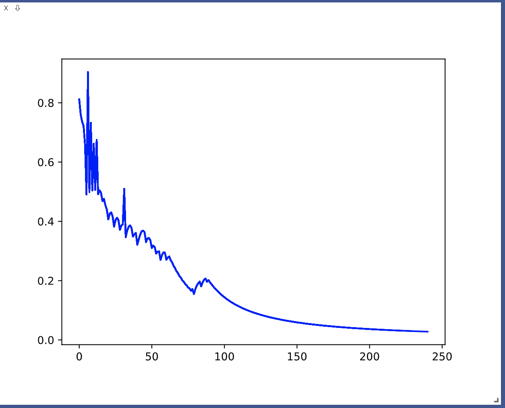
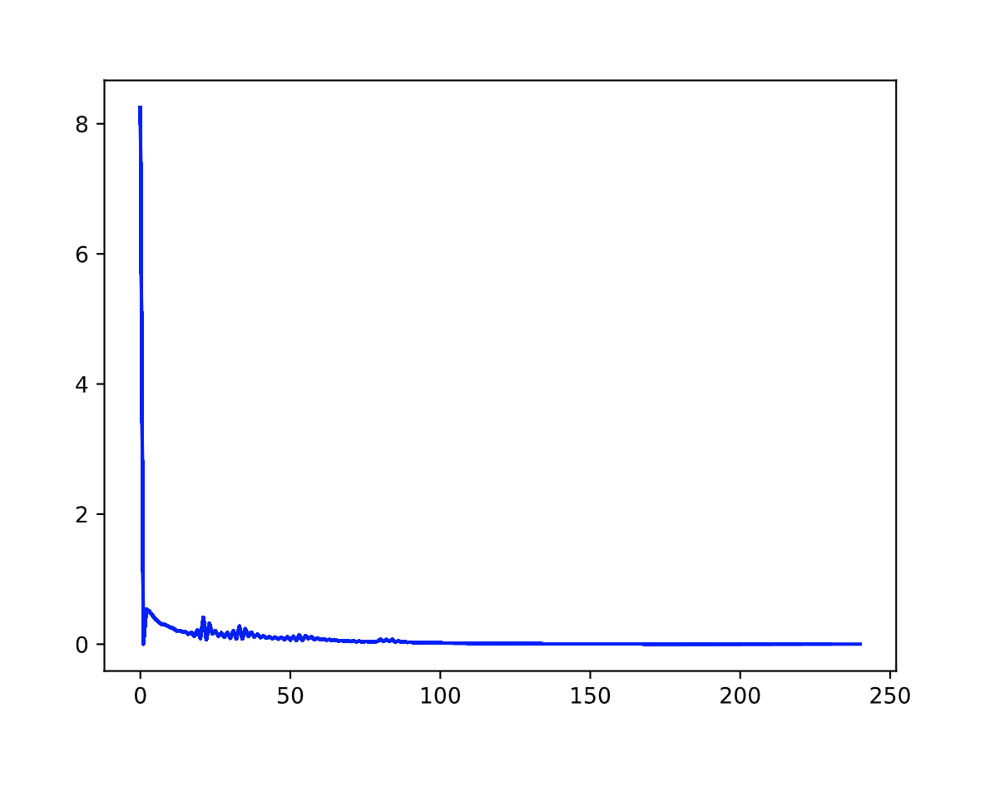
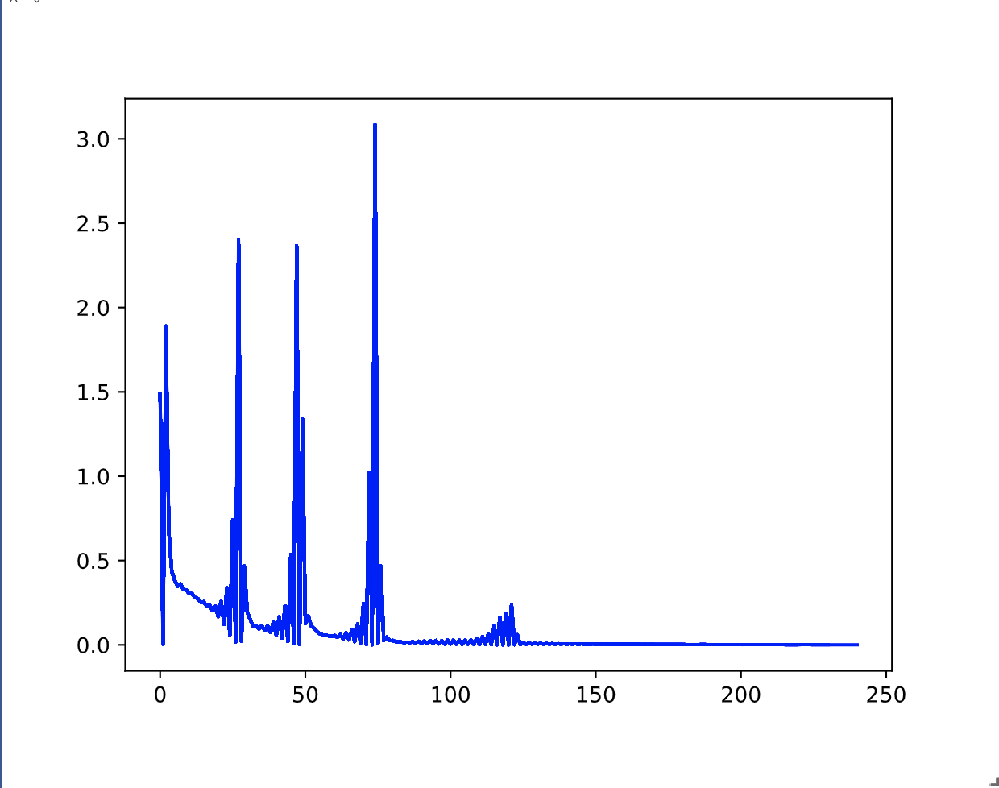

[](https://classroom.github.com/online_ide?assignment_repo_id=3476044&assignment_repo_type=AssignmentRepo)
# MiniTorch Module 3


* Docs: https://minitorch.github.io/

* Overview: https://minitorch.github.io/module3.html

This module requires `scalar.py`, `tensor_functions.py`, `tensor_data.py`, `tensor_ops.py`, `operators.py`, `module.py`, and `autodiff.py` from Module 2.

You will need to modify `tensor_functions.py` slightly in this assignment.

* Tests:

```
python run_tests.py
```

* Note:

Several of the tests for this assignment will only run if you are on a GPU machine and will not
run on github's test infrastructure. Please follow the instructions to setup up a colab machine
to run these tests.

***Task 3.5***

**Simple**


```
Epoch  0  loss  0.8115374843272172 correct 26 time 11.625386714935303
Epoch  10  loss  0.6615761135541888 correct 41 time 0.02391839027404785
Epoch  20  loss  0.4068036971581372 correct 32 time 0.024000167846679688
Epoch  30  loss  0.38979913860630033 correct 47 time 0.021924257278442383
Epoch  40  loss  0.3212170963629087 correct 34 time 0.02339768409729004
Epoch  50  loss  0.3101835572249518 correct 39 time 0.023936748504638672
Epoch  60  loss  0.27075266563884626 correct 41 time 0.021871328353881836
Epoch  70  loss  0.21000038599883403 correct 49 time 0.02933979034423828
Epoch  80  loss  0.1717407835622658 correct 38 time 0.022722721099853516
Epoch  90  loss  0.1945744672737717 correct 50 time 0.030732393264770508
Epoch  100  loss  0.1438322848895009 correct 50 time 0.023026227951049805
Epoch  110  loss  0.11292589294016127 correct 50 time 0.022498607635498047
Epoch  120  loss  0.09245892947420156 correct 50 time 0.023288249969482422
Epoch  130  loss  0.07804113624207626 correct 50 time 0.021452665328979492
Epoch  140  loss  0.06732902887709204 correct 50 time 0.020377635955810547
Epoch  150  loss  0.05912940330972499 correct 50 time 0.02082371711730957
Epoch  160  loss  0.052665544971095074 correct 50 time 0.023122072219848633
Epoch  170  loss  0.047445559736061925 correct 50 time 0.022700071334838867
Epoch  180  loss  0.04314295257132114 correct 50 time 0.025417089462280273
Epoch  190  loss  0.0395362615879149 correct 50 time 0.020892620086669922
Epoch  200  loss  0.03648121047686759 correct 50 time 0.024729490280151367
Epoch  210  loss  0.0338513918964994 correct 50 time 0.02340102195739746
Epoch  220  loss  0.03157223185221913 correct 50 time 0.032886505126953125
Epoch  230  loss  0.02957474381129582 correct 50 time 0.02794504165649414
Epoch  240  loss  0.02780764153777651 correct 50 time 0.022687673568725586
```

**Split**



```
Epoch  0  loss  1.5609712178159458 correct 23 time 38.90686798095703
Epoch  10  loss  0.3956823252456344 correct 36 time 36.58078622817993
Epoch  20  loss  0.24405058682284575 correct 36 time 36.27353811264038
Epoch  30  loss  0.16319759286645424 correct 38 time 38.163312911987305
Epoch  40  loss  0.05932979606828324 correct 44 time 36.28372621536255
Epoch  50  loss  0.0321580795058208 correct 45 time 36.363361120224
Epoch  60  loss  0.026326902316500454 correct 44 time 36.431159019470215
Epoch  70  loss  0.01849118736982443 correct 43 time 39.948671102523804
Epoch  80  loss  0.1140097327753707 correct 36 time 36.85290598869324
Epoch  90  loss  0.08004841948617662 correct 48 time 39.636653900146484
Epoch  100  loss  0.14216414059599874 correct 40 time 38.51074576377869
Epoch  110  loss  0.12651403950055073 correct 42 time 39.5247437953949
Epoch  120  loss  0.1174488637222927 correct 41 time 38.37309503555298
Epoch  130  loss  0.11420994998434644 correct 42 time 38.64535212516785
Epoch  140  loss  0.11178335323938132 correct 42 time 38.34345984458923
Epoch  150  loss  0.10171193257888919 correct 42 time 38.44995999336243
Epoch  160  loss  0.07664863229995376 correct 42 time 35.85861301422119
Epoch  170  loss  0.06372781136088944 correct 47 time 36.00898599624634
Epoch  180  loss  0.09841937057851154 correct 45 time 35.92341208457947
Epoch  190  loss  0.058189720114314704 correct 47 time 35.903928995132446
Epoch  200  loss  0.04729022141156698 correct 47 time 35.934301137924194
Epoch  210  loss  0.04559629531154273 correct 46 time 35.87049102783203
Epoch  220  loss  0.039776250020249676 correct 47 time 36.06775403022766
Epoch  230  loss  0.033145867627062654 correct 50 time 36.53035593032837
Epoch  240  loss  0.045897650169097595 correct 47 time 35.80701303482056
```

**Xor**



```
Epoch  0  loss  0.024902574736264584 correct 26 time 38.10047388076782
Epoch  10  loss  0.6012331491562034 correct 26 time 40.92750072479248
Epoch  20  loss  0.576780625021284 correct 32 time 39.680919885635376
Epoch  30  loss  0.5738186601095255 correct 36 time 39.62561392784119
Epoch  40  loss  0.5583142137025456 correct 41 time 39.12255382537842
Epoch  50  loss  0.5211720803976179 correct 44 time 38.98331618309021
Epoch  60  loss  0.32093449139331653 correct 40 time 39.56851601600647
Epoch  70  loss  0.5207819665166056 correct 42 time 40.39178228378296
Epoch  80  loss  0.5894514768245456 correct 46 time 40.687928199768066
Epoch  90  loss  0.7447713854448638 correct 43 time 37.18306589126587
Epoch  100  loss  0.8216234936870087 correct 40 time 36.55967831611633
Epoch  110  loss  0.560396860373704 correct 49 time 37.24839901924133
Epoch  120  loss  1.3646406213783717 correct 38 time 36.86709117889404
Epoch  130  loss  1.5130010671078427 correct 37 time 36.99037313461304
Epoch  140  loss  0.005525385849004935 correct 39 time 36.85008692741394
Epoch  150  loss  0.006025523542193962 correct 40 time 36.70703411102295
Epoch  160  loss  0.2653920781739778 correct 47 time 36.58102488517761
Epoch  170  loss  1.7631661043850027 correct 42 time 36.587404012680054
Epoch  180  loss  0.004763051032514996 correct 40 time 36.584954023361206
Epoch  190  loss  0.13473755155391454 correct 48 time 36.59445595741272
Epoch  200  loss  0.7146379288185862 correct 44 time 36.49580693244934
Epoch  210  loss  0.2217808503992011 correct 49 time 36.53260374069214
Epoch  220  loss  0.9259707798471719 correct 47 time 37.32451677322388
Epoch  230  loss  0.5631625933789642 correct 48 time 36.54123115539551
Epoch  240  loss  0.09284858387727321 correct 50 time 36.505409955978394
```
